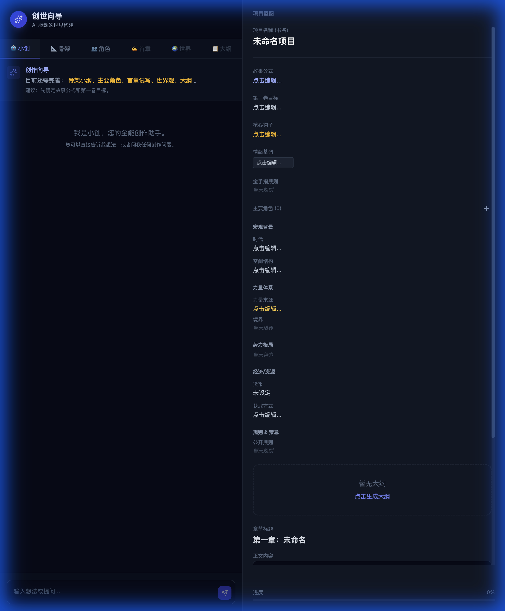
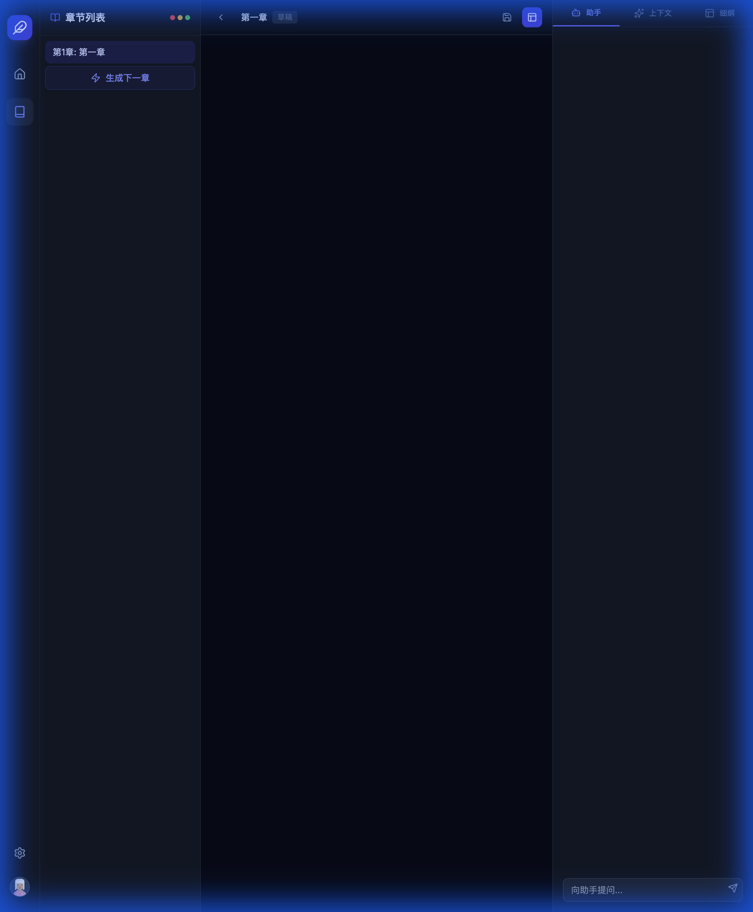

# AI Long-Form Writing Assistant - Portfolio Showcase

## 1. 项目概述 (Project Overview)

**项目名称**：AI 长篇小说写作助手 (AI Long-Form Writing Assistant)
**角色**：AI Product Manager / Full Stack Developer
**核心价值**：解决 LLM 在长文本生成中"遗忘设定"、"逻辑崩坏"的痛点，构建一套支持**全生命周期**（从创意孵化到完本）的 AI 辅助写作系统。

> "这不是一个生成爽文片段的玩具，而是一个能陪作者写完百万字长篇的智能工作台。"

---

## 2. 产品亮点 (Product Highlights)

作为 AI 产品经理，我从用户痛点出发，设计了以下核心功能模块：

### 2.1 结构化创意向导 (Genesis Wizard)
*   **痛点**：网文创作初期"万事开头难"，设定庞杂。
*   **解决方案**：设计了 **Genesis Wizard**，将复杂的创世过程拆解为标准化的 **"创意 -> 骨架 -> 角色 -> 世界观 -> 大纲"** 流水线。
*   **体验**：用户只需输入模糊灵感，多 Agent 协作自动补全细节，并实时可视化展示设定卡片。

### 2.2 基于 RAG 的"项目记忆" (Project Memory)
*   **痛点**：长篇写作中，AI 容易忘记前文设定（如主角第 50 章断臂，第 100 章又长出来了）。
*   **解决方案**：构建了**基于时间/章节维度的 RAG 策略**。
*   **机制**：
    *   **版本化管理**：所有设定（人物、势力）均带版本号和生效章节范围。
    *   **动态检索**：写第 N 章时，系统只检索"截止到第 N 章"有效的设定，确保逻辑严密。

### 2.3 沉浸式写作工作台 (The Studio)
*   **痛点**：作者需要在"查设定"和"写正文"之间频繁切换，打断心流。
*   **解决方案**：**左中右三栏式设计**。
    *   **左侧**：大纲导航，掌控全局节奏。
    *   **中间**：沉浸式编辑器，支持 AI 续写与润色。
    *   **右侧**：Copilot 与 Context 面板，AI 自动把当前章节需要的设定"喂"到手边，无需手动查找。

---

## 3. 技术亮点 (Technical Architecture)

本项目展示了从架构设计到落地的全栈工程能力，特别是在 **AI Agent 编排**与 **RAG 工程化**方面：

### 3.1 多 Agent 编排 (LangGraph)
*   摒弃单一大 Prompt 模式，采用 **LangGraph** 构建有状态、多节点的 Agent 工作流。
*   **架构**：`Router -> Skeleton -> Protagonist -> World -> Outline -> Finalizer`。
*   **优势**：每个 Agent 专注单一职责，生成过程可观测、可调试、可干预。

### 3.2 混合检索增强生成 (Hybrid RAG)
*   **存储层**：**PostgreSQL + pgvector**。
*   **策略**：
    *   **结构化检索**：利用 SQL 过滤 `project_id` 和 `chapter_range`，保证时空一致性。
    *   **语义检索**：利用 Vector Embedding 召回语义相关的设定片段。
*   **MCP 集成**：通过 **Model Context Protocol (MCP)** 标准化封装外部工具（如 Tavily Search），实现架构解耦。

### 3.3 现代全栈实现
*   **后端**：FastAPI (Async/Await) + Server-Sent Events (SSE) 实现流式响应，让 AI 思考过程对用户可见。
*   **前端**：React + Vite + TypeScript，构建高性能 SPA，提供丝滑的写作体验。

---

## 4. 核心功能展示 (Key Features Showcase)

*(以下图片位于 `docs/portfolio-pics/` 目录下)*

### 4.1 创世向导 (Genesis Wizard)
> *截图说明：展示多步生成流程，左侧对话引导，右侧实时生成结构化设定卡片。*
> 

### 4.2 写作工作台 (Studio Interface)
> *截图说明：核心写作界面，展示中间编辑器、右侧上下文面板（Context Panel）自动加载的设定信息。*
> 

### 4.3 智能助手与上下文 (Copilot & Context)
> *截图说明：展示 Copilot 针对选中文本进行润色，以及 Context 面板显示的 RAG 检索结果。*
> 

个人看来还欠缺对作者编辑后的回写校验闭环，未来可以用自动对比提醒吃书，让体验更安心。

#LangGraph多节点协作：基于 Router→Skeleton→Protagonist→World→Outline→Finalizer 流程，让每个 Agent 只关注自身任务并提供流式可观测性。
#HybridRAG记忆：PostgreSQL+pgvector 组合，既能按 project_id/chapter_range 精准过滤，又能用语义相似度召回最相关设定片段。
#SSE实时交互：FastAPI+SSE 把 LangGraph 每一步的状态推送到前端，写作助手像伙伴一样“边想边说”。
#MCP工具解耦：通过 MCP 封装 Tavily 搜索，把外部灵感源抽象成标准工具，便于替换与扩展。
